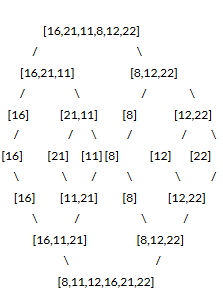

# Insort Short 

## Proje Detayları
---

* ### Birinci Çalışma
> [22,27,16,2,18,6]   Insertion Sort

 1. Yukarı verilen dizinin sort türüne göre aşamalarını yazınız.
 2.   Big-O gösterimini yazınız.
  3. Time Complexity: Average case: Aradığımız sayının ortada olması,Worst case: Aradığımız sayının sonda olması, Best case: Aradığımız sayının dizinin en başında olması.
 4. Dizi sıralandıktan sonra 18 sayısı hangi case kapsamına girer? Yazınız.
   * ### İkinci Çalışma
> [7,3,5,8,2,9,4,15,6] dizisinin Insertion Sort'a göre ilk 4 adımını yazınız.
---

 ##  Çözümler

   * ### Birinci Çalışma Çözümü

1. Sort türüne göre aşamalar; 
   [22,27,16,2,18,6] --> [2,27,16,22,18,6] --> [2,6,16,22,18,27] -->[2,6,16,18,22,27]
  1. Big O Gösterimi; O(n^2)
  2. Time Complexity:
 - Best Case: 2 
 -  Average Case: 16,18 
 -  Worst Case: 27
  4. Dizi sıralandıktan sonra 18 sayısı Average Case kapsamına girer. 
  ---
 * ### İkinci Çalışma Çözümü

[7,3,5,8,2,9,4,15,6] --> [2/7,3,5,8,9,4,15,6] --> [2,3/7,5,8,9,4,15,6]
--> [2,3,4/7,5,8,9,15,6] --> [2,3,4,5/7,8,9,15,6]

---
---
---

# Merge Sort
## Proje Detayları 
> [16,21,11,8,12,22] -> Merge Sort

   - Yukarıdaki dizinin sort türüne göre aşamalarını yazınız.
   - Big-O gösterimini yazınız.
  ---
  ## Çözüm

> ### Big-O gösterimi; O(nlogn)
---

   

---
---
---
# Binary Search Tree
## Proje Detayları 
>[7, 5, 1, 8, 3, 6, 0, 9, 4, 2] dizisinin Binary-Search-Tree aşamalarını yazınız.

Örnek: root x'dir. root'un sağından y bulunur. Solunda z bulunur vb.

---
 ## Çözüm

 Diziyi küçükten büyüğe sıralayalım
> [0,1,2,3,4,5,6,7,8,9]
> - Root Değer : 5
- Küçük değer sola, büyük değer sola yazılacak şekilde sıralamayı yapalım;

- Sağ tarafa : 7
 - Sol tarafa : 3
- En küçük : 0
- En Büyük : 9 

											 5
										 3		 7	
									  2	   4   6   8
								   1				 9
								 0			
   